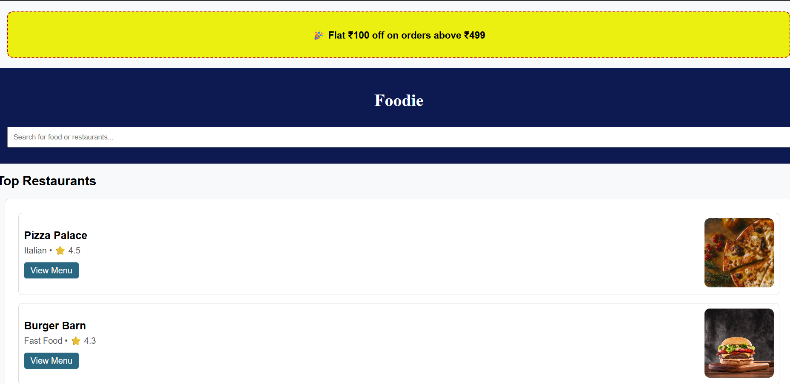
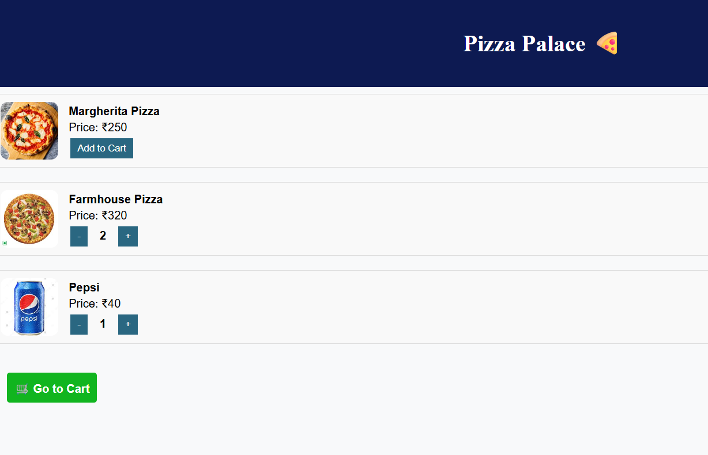
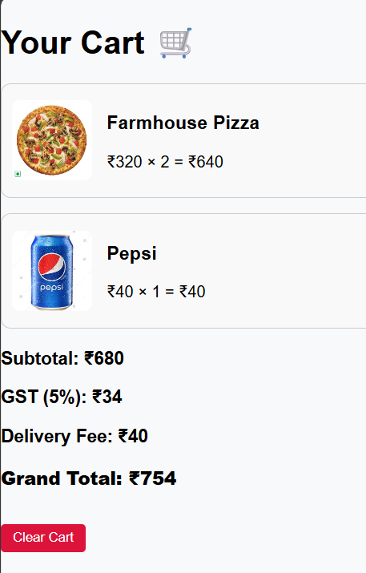

# Foodie - Online Food Ordering App

**Foodie** is a simple and elegant food ordering frontend app where users can:
- Browse top restaurants
- View their menu
- Add items to cart
- See pricing with tax and delivery fee

---

##  Features

-  Browse restaurant listings
-  View food menus
-  Add items to cart
-  Automatic price calculation with tax and delivery
-  Fully responsive UI

---

###  Home Page
Shows top restaurants with cuisine type and rating.

---

###  Restaurant Menu
Users can view menu items and add them to cart.

---

###  Cart Summary
Shows items added, pricing, tax, and total amount.

---

## ⚙Tech Stack

- **Frontend**: HTML, CSS, JavaScript
- ** Backend**: Node.js / JSON Server (not required for static version)

---

##  How to Run

1. Clone the repository
2. Open `index.html` in a browser
3. Interact with the UI

